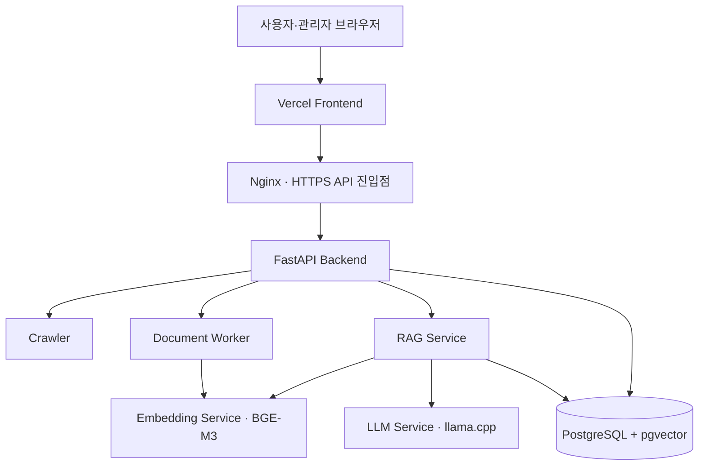
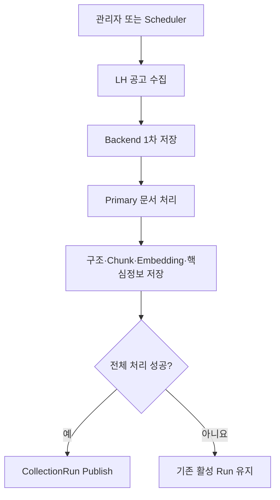
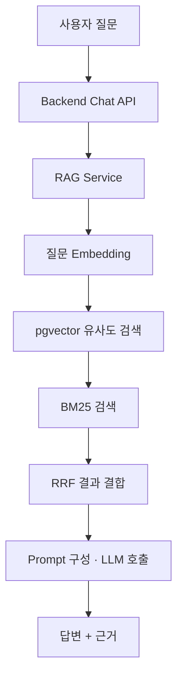

# DDOKBOT (똑봇)

> 복잡한 LH 임대주택 공고문을 구조화하고, 핵심정보와 근거 기반 답변을 제공하는 HWP/HWPX 문서 RAG 서비스

## 서비스

- 사용자 서비스: https://ddokbot.codefoilo.store/
- 관리자 서비스: https://ddokbot.admin.codefoilo.store/
- API 상태 확인: https://ddokbot-api.hwanmade.store/api/health

사용자는 공고를 검색하고 핵심 일정·자격·공급정보를 확인한 뒤, 선택한 공고에 대해 질문할 수 있습니다. 관리자는 공고 수집, 문서 처리 상태, 오류 재시도, 용어 사전을 관리합니다.

## 해결하려는 문제

LH 공고문은 HWP/HWPX 파일로 제공되고, 중요한 정보가 긴 문단과 복잡한 표에 흩어져 있습니다. DDOKBOT은 다음 과정을 자동화합니다.

1. LH 공고와 첨부문서 수집
2. HWP/HWPX 파싱·정규화·구조화
3. 검색 단위 Chunk 생성과 BGE-M3 임베딩
4. 핵심정보 추출 및 PostgreSQL 저장
5. 선택한 공고 안에서 근거 검색
6. 근거를 사용한 답변과 출처 제공

DDOKBOT은 자격 여부를 대신 판정하지 않습니다. 원문에 근거한 정보 탐색과 이해를 돕는 서비스입니다.

## 주요 기능

### 사용자

- 최신 임대주택 공고 목록, 검색, 지역·상태 필터
- 공고 상세정보 및 원문 다운로드
- 신청기간, 공급정보, 자격, 임대조건 등 핵심정보 확인
- 선택한 공고 범위의 질의응답
- 답변에 사용된 근거 문장 확인
- 어려운 공고 용어 설명

### 관리자

- LH 공고 전체 수집 및 개별 공고 재수집
- 문서 처리 상태와 실행 이력 확인
- 실패 단계 확인 및 재시도
- 오류 상태와 해결 메모 관리
- 용어 사전 관리
- 수집 결과의 처리·발행 상태와 보관 데이터 확인

## 전체 시스템 아키텍처



Frontend는 Vercel에 배포되어 있으며 `/api` 요청을 AWS의 Nginx로 전달합니다. Backend는 사용자·관리자 API를 제공하고 Crawler, Document Worker, RAG Service를 HTTP로 호출합니다.

## 두 가지 실행 흐름

### 1. 문서를 미리 처리해 저장하는 흐름



Crawler는 LH 상세페이지의 첨부 영역을 기준으로 문서 역할을 지정합니다.

- `공고문` 영역: `primary`
- `다운로드` 영역: `supporting`
- 영역을 판별할 수 없음: `unknown`

Worker는 Primary 문서를 파싱, 정규화, 구조화, 검증, 청킹하고 Embedding Service를 호출한 뒤 핵심정보를 추출합니다. Backend는 결과를 검증해 `ProcessingRun`, `DocumentStructure`, `ChunkSet`, `Chunk`, `Embedding`, `KeyInformation`으로 저장합니다.

모든 공고가 발행 조건을 충족한 경우에만 새 `CollectionRun`을 사용자 데이터로 활성화합니다. 실패하면 기존 활성 Run이 계속 제공됩니다.

### 2. 저장된 근거를 검색해 답하는 흐름



현재 검색은 같은 공고 범위에서 Vector Search를 실행한 뒤 BM25 Search를 실행하고, 두 순위를 RRF로 결합합니다. 별도의 Reranker 모델은 사용하지 않습니다.

## 기술 스택

| 영역 | 기술 |
|---|---|
| Frontend | React 19, TypeScript, Vite, Tailwind CSS, Vercel |
| Backend/API | Python 3.12, FastAPI, Pydantic, SQLAlchemy, Alembic |
| Database | PostgreSQL 16, pgvector |
| Document | HWP/HWPX Parser, Normalization, Structure, Chunking |
| Embedding | BAAI/bge-m3, Sentence Transformers |
| Retrieval | pgvector, BM25, Kiwi, RRF |
| Generation | llama.cpp, Gemma GGUF, Prompt Routing |
| Infrastructure | AWS, Docker Compose, Nginx, Cloudflare, GitHub Actions |

## Docker 서비스 구성

운영 구성의 기준 파일은 `infra/docker-compose.yml`입니다.

| 서비스 | 역할 | 호스트 포트 |
|---|---|---:|
| `nginx` | 외부 HTTPS API 진입점 | 80, 443 |
| `postgres` | PostgreSQL 및 pgvector | 5432 |
| `backend` | 사용자·관리자 API와 서비스 조정 | 18000 |
| `scheduler` | 정기 수집 실행 | 외부 노출 없음 |
| `crawler` | LH 공고 및 첨부문서 수집 | 18004 |
| `document-worker` | 문서 처리 Pipeline 실행 | 18003 |
| `embedding` | BGE-M3 임베딩 생성 | 18001 |
| `rag` | 검색, Prompt 구성, 답변 생성 조정 | 18002 |
| `llm` | llama.cpp 추론 서버 | 8080 |

자세한 구성과 모델 Mount 방법은 [Docker AI Services](docs/DOCKER_AI_SERVICES.md)를 참고합니다.

## 실행 방법

### 사전 준비

- Docker 및 Docker Compose
- NVIDIA GPU Driver와 Container Toolkit
- BGE-M3 모델 파일
- llama.cpp에서 사용할 GGUF 모델
- `.env.example`을 복사한 `.env`

```bash
git clone https://github.com/growingondev/one-cycle.git
cd one-cycle

cp .env.example .env
# 비밀번호와 모델 호스트 경로를 실제 환경에 맞게 수정
```

### Docker 실행

```bash
docker compose \
  --env-file .env \
  -f infra/docker-compose.yml \
  --profile ai \
  build

docker compose \
  --env-file .env \
  -f infra/docker-compose.yml \
  --profile ai \
  up -d

docker compose \
  --env-file .env \
  -f infra/docker-compose.yml \
  run --rm backend alembic upgrade head
```

### 상태 확인

```bash
curl -fsS http://127.0.0.1:18000/api/health
curl -fsS http://127.0.0.1:18000/api/health/db
curl -fsS http://127.0.0.1:18004/health
curl -fsS http://127.0.0.1:18002/health
curl -fsS http://127.0.0.1:18001/health
curl -fsS http://127.0.0.1:8080/health
```

환경변수와 평가 환경을 포함한 상세 실행 방법은 [Environment](docs/ENVIRONMENT.md)와 [문서 인덱스](docs/README.md)를 참고합니다.

## CI/CD

- `develop-api`, `main` 대상 Pull Request와 Push에서 CI 실행
- Python 정적 검사, Backend·Crawler·Worker 테스트, Migration SQL 생성, Docker Compose 구성 검증
- 사용자·관리자 Frontend Production Build 검증
- `main` CI 성공 후 GitHub Actions가 AWS에 SSH 접속
- Nginx, Backend, Crawler, Document Worker, RAG 이미지 재빌드
- Alembic Migration 적용, 컨테이너 재시작, 내부·외부 Health Check 수행
- 사용자·관리자 Frontend는 Vercel에서 별도로 배포

Embedding과 LLM 이미지는 모델 크기와 GPU 운영 비용 때문에 현재 AWS CD의 자동 재빌드 대상에서 제외되어 있습니다. 자세한 내용은 [CI](docs/CI.md)를 참고합니다.

## 프로젝트 구조

```text
one-cycle/
├── backend/           FastAPI API, 업무 로직, ORM Model
├── crawler/           LH 공고 및 첨부문서 수집
├── document_worker/   문서 처리 HTTP Service
├── pipeline/          Parsing부터 Embedding까지의 처리 로직
├── rag/               Retrieval과 Generation 핵심 로직
├── services/          Embedding·RAG HTTP Service
├── frontend/
│   ├── user/          사용자 React 서비스
│   └── admin/         관리자 React 서비스
├── migrations/        Alembic DB Migration
├── evaluation/        평가 Dataset과 평가 실행 코드
├── infra/             Dockerfile, Compose, Nginx 설정
├── tests/             Backend·Crawler·Worker 테스트
└── docs/              상세 기술 및 운영 문서
```

`pipeline/embedding`은 공통 임베딩 처리 로직이고, `services/embedding`은 이를 HTTP로 제공하는 서비스 경계입니다. `rag`은 검색·생성 로직이며, `services/rag`은 외부 HTTP 진입점을 제공합니다.

## 핵심 문서

- [문서 전체 인덱스](docs/README.md)
- [Backend](docs/BACKEND.md)
- [Database](docs/DATABASE.md)
- [Document Processing](docs/DOCUMENT_PROCESSING.md)
- [Document Worker API](docs/DOCUMENT_WORKER_API_EXPLANATION.md)
- [Chunking](docs/CHUNKING.md)
- [Embedding](docs/EMBEDDING.md)
- [RAG](docs/RAG.md)
- [Frontend](docs/FRONTEND.md)
- [내부 서비스 API 계약](docs/SERVICE_API_CONTRACT.md)
- [Docker AI Services](docs/DOCKER_AI_SERVICES.md)
- [Environment](docs/ENVIRONMENT.md)
- [Evaluation](docs/EVALUATION.md)
- [CollectionRun 보관·삭제](docs/COLLECTION_RUN_RETENTION.md)

## 현재 범위와 한계

- LH 임대주택 공고와 HWP/HWPX 문서를 대상으로 합니다.
- 질문은 사용자가 선택한 한 공고의 활성 처리 결과 안에서 검색합니다.
- Supporting 문서는 수집·보관하지만 사용자 검색의 주 처리 대상은 Primary 문서입니다.
- 법적·행정적 자격 판정을 제공하지 않으며 실제 신청 전 원문 확인이 필요합니다.
- 실제 LH 크롤링, GPU 모델 로딩, LLM 품질 평가는 경량 CI에 포함하지 않습니다.
- 모델 파일과 운영 비밀값은 저장소에 포함하지 않습니다.
