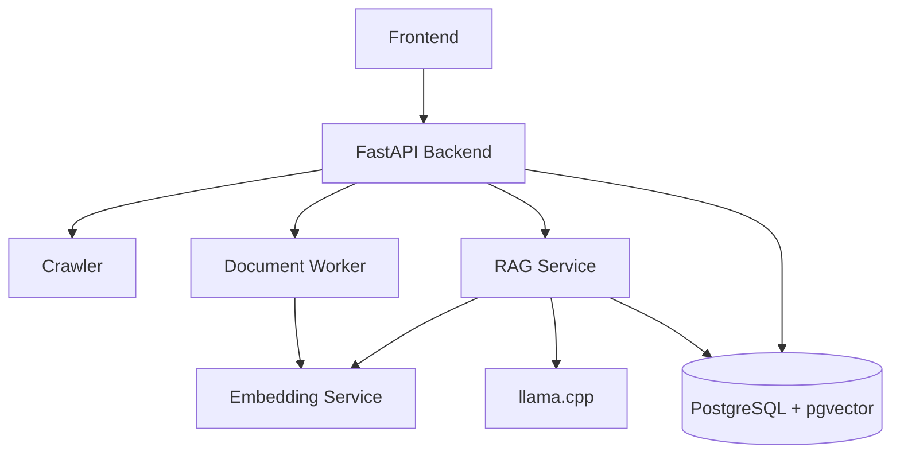

# Backend Integration

## 1. 현재 통합 구조

Backend는 사용자·관리자 API를 제공하고 Crawler, Document Worker, RAG Service를 HTTP로 호출합니다. 서비스가 공유해야 하는 영속 데이터는 PostgreSQL과 공유 Volume에 저장합니다.



## 2. 통신 방식

| 호출 | 방식 | 데이터 |
|---|---|---|
| Frontend → Backend | HTTPS | JSON, 파일 응답 |
| Backend → Crawler | HTTP Job API | 수집 조건, 상태, 결과 |
| Backend → Document Worker | HTTP | 문서 ID·경로, 처리 결과 |
| Document Worker → Embedding | HTTP | Chunk ID·텍스트, Vector |
| Backend → RAG | HTTP | 공고 ID·질문, 답변·근거 |
| RAG → Embedding | HTTP | 질문 텍스트, Vector |
| RAG → llama.cpp | HTTP | OpenAI 호환 Chat 요청 |
| Backend·RAG → PostgreSQL | SQLAlchemy/SQL | 운영 데이터와 Vector |
| Crawler·Worker·Backend | 공유 Volume | 원본 문서와 처리 산출물 |

Container 내부의 Parser·Normalizer·Structure·Chunking은 Python 함수 또는 하위 프로세스와 파일 입출력을 사용합니다. 서로 다른 Container의 경계를 넘을 때 HTTP를 사용합니다.

## 3. 전체 수집

```text
관리자 또는 Scheduler
  → Backend Integration Service
  → Crawler Job 생성·대기
  → Collection 결과 DB 저장
  → Primary 문서 목록 생성
  → 각 문서를 Worker로 처리
  → Worker 결과 DB 저장·활성화
  → Collection 전체 검증
  → Publish 또는 기존 Run 유지
```

관리자 버튼 요청이 Crawler HTTP 응답을 받는 순간 끝나는 구조가 아니라, 현재 Backend 실행 흐름이 수집 결과를 기다린 뒤 저장과 문서 처리까지 조정합니다.

## 4. 개별 재수집과 재처리

- 개별 공고 재수집: Crawler에서 해당 공고와 첨부파일을 다시 받아 DB의 문서 상태·역할·파일을 갱신합니다.
- 개별 문서 재처리: 저장된 문서 한 건을 Worker에 다시 보내 새 ProcessingRun을 만듭니다.
- 오류 재시도: ErrorLog의 단계와 대상에 따라 다운로드 재시도 또는 문서 단계 재처리를 실행합니다.

이 작업들은 성공하더라도 새 공고 묶음을 자동 Publish하지 않습니다. 사용자 목록은 `system_state.active_collection_run_id`가 가리키는 기존 활성 CollectionRun을 계속 사용합니다.

## 5. 공유 경로

운영 Compose의 기준 경로는 다음과 같습니다.

| 데이터 | Container 경로 | Host 설정 |
|---|---|---|
| 원본 문서 | `/data/documents` | `DOCUMENT_STORAGE_HOST_PATH` |
| Pipeline 출력 | `/app/outputs` | `PIPELINE_OUTPUT_HOST_PATH` |

Backend와 Worker가 같은 문서를 보려면 Host의 동일 디렉터리를 각각 같은 Container 경로에 Mount해야 합니다. DB의 `storage_path`와 Worker가 접근하는 실제 경로가 일치해야 합니다.

## 6. 운영 환경변수

| 변수 | Docker 값 |
|---|---|
| `CRAWLER_SERVICE_BASE_URL` | `http://crawler:8000` |
| `DOCUMENT_WORKER_BASE_URL` | `http://document-worker:18003` |
| `RAG_SERVICE_BASE_URL` | `http://rag:18002` |
| `EMBEDDING_SERVICE_URL` | `http://embedding:18001` |
| `LLAMA_BASE_URL` | `http://llm:8080` |
| `POSTGRES_HOST` | `postgres` |

Docker Container 사이에서는 `localhost`가 아니라 Compose Service 이름을 사용합니다.

## 7. 실패 처리

내부 HTTP 공통 오류는 설정 오류, 연결 불가, HTTP 오류, 응답 형식 오류로 구분합니다. Backend는 이를 사용자 API 상태 코드와 ErrorLog로 변환합니다.

문서 처리 실패는 단계별 ErrorLog를 남기고 전체 Publish를 막습니다. 이 때문에 새 데이터가 일부만 성공해도 기존 활성 CollectionRun이 사용자에게 계속 제공됩니다.

## 8. 확인할 파일

- `backend/app/services/integration_service.py`
- `backend/app/services/collection_service.py`
- `backend/app/services/document_processing_service.py`
- `backend/app/services/collection_publish_service.py`
- `backend/app/clients/`
- `document_worker/service.py`
- `infra/docker-compose.yml`
