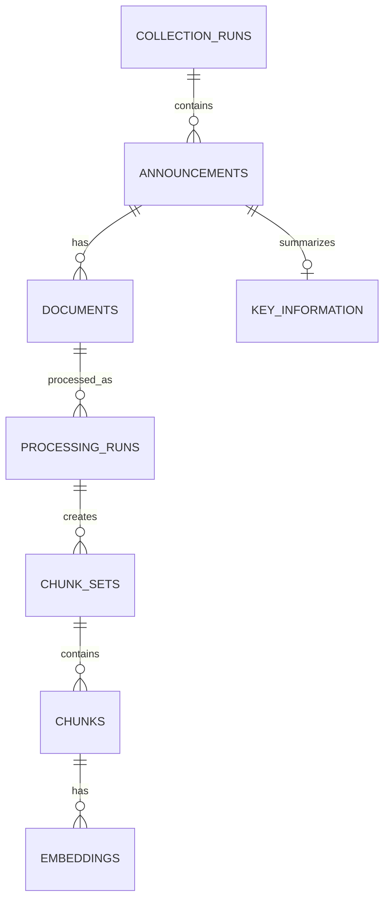

# Database

## 1. 구성

DDOKBOT은 PostgreSQL 16과 pgvector를 사용합니다. SQLAlchemy ORM으로 테이블을 정의하고 Alembic으로 Schema 변경을 관리합니다.

```text
PostgreSQL 16
  └─ pgvector Extension
       └─ embeddings.embedding vector(1024)
```

Docker 이미지는 `pgvector/pgvector:0.8.2-pg16`, Volume 이름은 `one-cycle-postgres-data`입니다. Host Port는 보안을 위해 `127.0.0.1:5432`에만 연결합니다.

## 2. 핵심 관계



`system_state`가 현재 사용자에게 제공할 CollectionRun을 선택합니다.

## 3. 테이블과 컬럼

### `collection_runs`

전체 공고 수집 한 번을 나타냅니다.

| 컬럼 | 의미 |
|---|---|
| `id` | 내부 PK |
| `execution_id` | Crawler 실행 식별자 |
| `status` | 실행 상태 |
| `total_announcement_count` | 전체 공고 수 |
| `successful_announcement_count` | 성공 공고 수 |
| `failed_announcement_count` | 실패 공고 수 |
| `fatal_error` | 실행 전체를 중단시킨 오류 |
| `started_at`, `finished_at` | 시작·종료 시각 |
| `created_at` | DB 생성 시각 |

### `announcements`

CollectionRun에 포함된 공고입니다. 같은 LH 공고도 수집 Run이 달라지면 별도 Row로 저장될 수 있습니다.

| 컬럼 | 의미 |
|---|---|
| `id` | 내부 공고 ID |
| `collection_run_id` | 소속 CollectionRun |
| `source_announcement_id` | LH 원본 공고 식별자 |
| `notice_number` | 공고 번호 |
| `title` | 공고명 |
| `detail_url` | LH 상세 URL |
| `region` | 지역 |
| `notice_type` | 공고 유형 |
| `announcement_date` | 게시일 |
| `deadline_date` | 마감일 |
| `publication_status` | 공고 상태 |
| `created_at` | 생성 시각 |

### `documents`

공고에 첨부된 원본 파일입니다.

| 컬럼 | 의미 |
|---|---|
| `id` | 문서 ID |
| `announcement_id` | 소속 공고 |
| `original_filename` | LH 파일명 |
| `document_format` | `hwp` 또는 `hwpx` |
| `document_role` | `primary`, `supporting`, `unknown` |
| `storage_path` | 공유 Volume의 원본 파일 경로 |
| `file_size_bytes` | 파일 크기 |
| `checksum_sha256` | 중복·무결성 확인 Hash |
| `download_status` | 다운로드 상태 |
| `error_message` | 다운로드 오류 |
| `created_at` | 생성 시각 |

`documents.document_format`은 수집 시 등록된 형식입니다. 실제 내부 형식은 Document Worker가 처리 시 다시 판별하며, 두 값이 다르면 실제 형식에 맞는 Parser를 사용합니다. 현재 Worker의 보정 응답만으로 `documents.document_format`을 자동 변경하지는 않습니다.

### `processing_runs`

문서 한 건을 특정 Pipeline 버전으로 처리한 실행입니다.

| 컬럼 | 의미 |
|---|---|
| `id` | 처리 실행 ID |
| `document_id` | 처리한 문서 |
| `execution_status` | 실행 성공·실패 상태 |
| `verification_status` | 검증 결과 |
| `current_stage` | 현재 또는 마지막 단계 |
| `pipeline_version` | Pipeline 버전 |
| `output_root_path` | 산출물 Root |
| `exit_code` | 실행 종료 코드 |
| `error_stage`, `error_code`, `error_message` | 실패 정보 |
| `parser_warning_count` | Parser 경고 수 |
| `normalizer_warning_count` | Normalizer 경고 수 |
| `verification_error_count` | 검증 오류 수 |
| `verification_warning_count` | 검증 경고 수 |
| `started_at`, `finished_at` | 실행 시간 |
| `is_active`, `activated_at` | 이 문서의 활성 처리 버전 여부와 시각 |
| `created_at` | 생성 시각 |

### `document_structures`

구조화된 문서 JSON을 저장합니다.

| 컬럼 | 의미 |
|---|---|
| `id` | 구조 ID |
| `processing_run_id` | 원본 처리 실행 |
| `schema_version` | 구조 JSON Schema 버전 |
| `structure_json` | 문단·표·Section 구조 |
| `element_count` | 구조 요소 수 |
| `content_hash` | 내용 Hash |
| `created_at` | 생성 시각 |

### `processing_artifacts`

Pipeline 단계별 파일 산출물의 위치와 무결성 정보를 기록합니다.

| 컬럼 | 의미 |
|---|---|
| `id` | 산출물 ID |
| `processing_run_id` | 소속 처리 실행 |
| `artifact_type` | Parsed, Normalized, Structure 등 종류 |
| `storage_path` | 파일 경로 |
| `file_size_bytes` | 파일 크기 |
| `checksum_sha256` | 파일 Hash |
| `schema_version` | 산출물 Schema 버전 |
| `artifact_metadata` | 추가 정보 JSON |
| `created_at` | 생성 시각 |

### `chunk_sets`

한 ProcessingRun에서 생성된 Chunk 묶음입니다.

| 컬럼 | 의미 |
|---|---|
| `id` | ChunkSet ID |
| `processing_run_id` | 원본 처리 실행 |
| `chunker_version` | Chunker 버전 |
| `strategy` | Chunking 전략 |
| `chunking_config` | 크기·Overlap 등 설정 |
| `input_content_version` | 입력 구조 버전 |
| `status` | 생성 상태 |
| `is_active` | 검색에 사용할 활성 묶음 여부 |
| `chunk_count` | Chunk 수 |
| `error_message` | 오류 메시지 |
| `started_at`, `finished_at`, `activated_at` | 실행·활성 시각 |
| `created_at` | 생성 시각 |

### `chunks`

검색의 기본 단위입니다.

| 컬럼군 | 주요 컬럼과 의미 |
|---|---|
| 식별 | `id`, `chunk_set_id`, `announcement_id`, `document_id`, `external_chunk_key`, `chunk_index` |
| 내용 | `content_type`, `title`, `section_path`, `content`, `search_text`, `embedding_text` |
| 크기 | `token_count`, `character_count` |
| 출처 | `source_block_ids`, `source_table_id`, `source_page`, `source_reference` |
| 기타 | `chunk_metadata`, `content_hash`, `status`, `created_at` |

`content`는 사용자 근거 표시용, `search_text`는 BM25용, `embedding_text`는 Vector 생성용입니다.

### `embeddings`

Chunk별 Dense Vector를 저장합니다.

| 컬럼 | 의미 |
|---|---|
| `id` | Embedding ID |
| `chunk_id` | 대상 Chunk |
| `model_name`, `model_version` | 모델 정보 |
| `dimension` | Vector 차원, 현재 1024 |
| `normalized` | L2 정규화 여부 |
| `embedding_text_hash` | 입력 텍스트 Hash |
| `embedding` | pgvector Vector |
| `status` | 생성 상태 |
| `error_code`, `error_message` | 실패 정보 |
| `created_at` | 생성 시각 |

### `key_information`

사용자 상세 화면에 표시할 핵심정보입니다.

| 컬럼 | 의미 |
|---|---|
| `id` | 핵심정보 ID |
| `announcement_id` | 대상 공고 |
| `source_processing_run_id` | 근거가 된 처리 버전 |
| `application_period` | 신청기간 JSON |
| `eligibility` | 신청자격 JSON |
| `supply_information` | 공급정보 JSON |
| `income_asset_criteria` | 소득·자산 기준 JSON |
| `required_documents` | 제출서류 JSON |
| `winner_announcement` | 당첨자 발표 JSON |
| `contact_information` | 문의처 JSON |
| `extraction_status` | 추출 상태 |
| `is_verified` | 검증 여부 |
| `created_at`, `updated_at` | 생성·수정 시각 |

### `system_state`

| 컬럼 | 의미 |
|---|---|
| `id` | 단일 상태 Row ID |
| `active_collection_run_id` | 현재 사용자에게 제공할 Run |
| `previous_collection_run_id` | 직전 Run |
| `updated_at` | 변경 시각 |

### `error_logs`

수집·처리·Publish·Retention·RAG 오류를 기록합니다.

| 컬럼군 | 주요 컬럼 |
|---|---|
| 대상 | `collection_run_id`, `announcement_id`, `document_id`, `processing_run_id` |
| 오류 | `error_type`, `error_code`, `stage`, `message`, `target_filename`, `stack_trace` |
| 운영 | `status`, `resolution`, `created_at`, `resolved_at` |

### `glossary`

`term`, `definition`, `category`, `is_active`, 생성·수정 시각을 저장합니다. CollectionRun과 독립적으로 관리합니다.

### `admins`

관리자 `login_id`, `password_hash`, `name`, `role`, `is_active`, 마지막 로그인 시각과 생성·수정 시각을 저장합니다.

## 4. 활성 데이터 규칙

- 사용자 공고 목록: 활성 CollectionRun의 Announcement만 조회
- 사용자 검색: 활성 ProcessingRun과 활성 ChunkSet의 Chunk만 사용
- 핵심정보: 공고는 유지하되 추출되지 않은 필드는 빈 값일 수 있음
- 개별 문서 재처리 성공: 그 문서의 ProcessingRun을 갱신하지만 CollectionRun을 자동 Publish하지 않음

## 5. Schema 변경

DB 구조 변경은 ORM만 수정하지 않고 Alembic Migration을 함께 작성합니다. 운영 배포에서는 AWS CD가 `alembic upgrade head`를 한 번 실행합니다.

관련 위치:

- `backend/app/models/`
- `backend/app/db/`
- `migrations/`
- `alembic.ini`
- `infra/postgres/init/`
